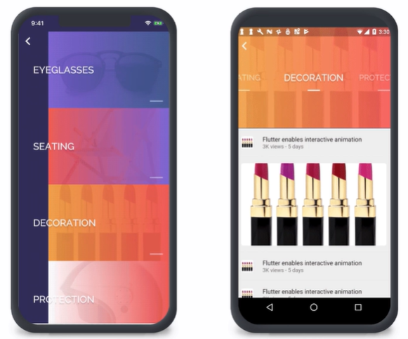

# flutter 的介绍
## 一、大致介绍
- Flutter 是谷歌的 UI 工具包，用于从单个代码库构建用于移动、Web和桌面的美丽本地汇编应用程序

- 其次，使用一套丰富的完全可定制的小部件在几分钟内构建本地接口 . 

- 
  
Flutter 的小部件包含所有关键平台差异 : 
  如滚动、导航、图标和字体，可在 <strong>iOS 和 Android</strong> 上提供完整的原生性能。

##  二、flutter 使用的语言

- Flutter 使用的是 Google 自己开发的网络编程语言——Dart 语言
    - 因此，开发者只要使用过 Java 或 JavaScript 之类的语言，那么 Flutter 也极容易上手
    - 下载这两个插件在Android studio中可以直接创建flutter文件

## 三、创建方法
- 可以直接用new 一个flutter的文件创建
- 代码如下：
<code>
import 'package:flutter/material.dart'; 
   &nbsp;&nbsp;&nbsp;&nbsp;void main() { 
    &nbsp;&nbsp;&nbsp;&nbsp;&nbsp;&nbsp;&nbsp;&nbsp;runApp(Center( 
    &nbsp;&nbsp;&nbsp;&nbsp;&nbsp;&nbsp;&nbsp;&nbsp;child: Text('Hello World!') 
&nbsp;&nbsp;&nbsp;&nbsp;)); 
&nbsp;&nbsp;&nbsp;&nbsp;} 

</code>

## 四、框架结构
- 主要包括以下三个结构
    - Flutter engine
    - Foundation library
    - Design-specific widgets

