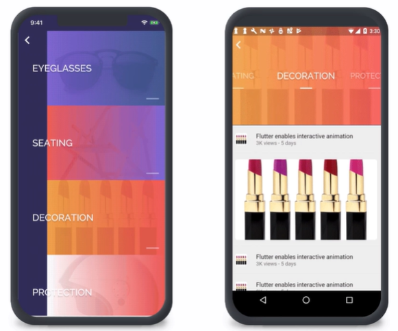

# flutter 的介绍
## 一、大致介绍
- flutter的网页链接为[flutter官网及其文档](https://flutter.dev/docs)
- Flutter 是谷歌的 UI 工具包，用于从单个代码库构建用于移动、Web和桌面的美丽本地汇编应用程序

- 其次，使用一套丰富的完全可定制的小部件在几分钟内构建本地接口 . 

- 
  
Flutter 的小部件包含所有关键平台差异 : 
  如滚动、导航、图标和字体，可在 <strong>iOS 和 Android</strong> 上提供完整的原生性能。

##  二、flutter 使用的语言

- Flutter 使用的是 Google 自己开发的网络编程语言——Dart 语言
    - 因此，开发者只要使用过 Java 或 JavaScript 之类的语言，那么 Flutter 也极容易上手
    - 下载这两个插件在Android studio中可以直接创建flutter文件

## 三、创建方法
- 可以直接用new 一个flutter的文件创建
- 查找主安卓工作室工具栏
- 在目标选择器中，选择一个Android设备来运行应用程序。如果没有被列为可用，请选择工具>安卓>AVD管理器，并在那里创建一个
- 单击工具栏中的运行图标，或调用菜单项"运行 ">"运行"。应用程序构建完成后，您将在设备上看到入门应用。
- 实现一个hello world的代码如下：
  
import 'package:flutter/material.dart'; 
     &nbsp;&nbsp;&nbsp;&nbsp;void main() { 
    &nbsp;&nbsp;&nbsp;&nbsp;&nbsp;&nbsp;&nbsp;&nbsp;runApp(Center( 
    &nbsp;&nbsp;&nbsp;&nbsp;&nbsp;&nbsp;&nbsp;&nbsp;child: Text('Hello World!') 
  &nbsp;&nbsp;&nbsp;&nbsp;)); 
  &nbsp;&nbsp;&nbsp;&nbsp;} 
- 小部件的创建
    - Text：
        - 该小部件允许您在应用程序内创建一系列样式文本。Text
    - Row, Column：
        - 这些弹性小部件可让您在水平（）和垂直（）方向创建灵活的布局。这些对象的设计基于 Web 的 Flexbox 布局模型。RowColumn
    - Stack：
        - 小部件不是以线性为导向（水平或垂直），而是让您按油漆顺序将小部件放在彼此的顶部。然后，您可以使用"定位"小部件在堆栈的顶部、右侧、底部或左边缘放置它们。堆栈基于 Web 的绝对定位布局模型。StackStack
    - Container：
        - 小部件允许您创建一个矩形视觉元素。容器可以装饰有盒装装饰，如背景、边框或阴影。A 还可以对其尺寸施加边距、填充和约束。此外，还可以使用矩阵在三维空间中进行转换。ContainerContainerContainer
- 在用户界面中可以添加手势，动画，自定义字体等
## 四、框架结构
- 主要包括以下三个结构
    - Flutter engine
    - Foundation library
    - Design-specific widgets

